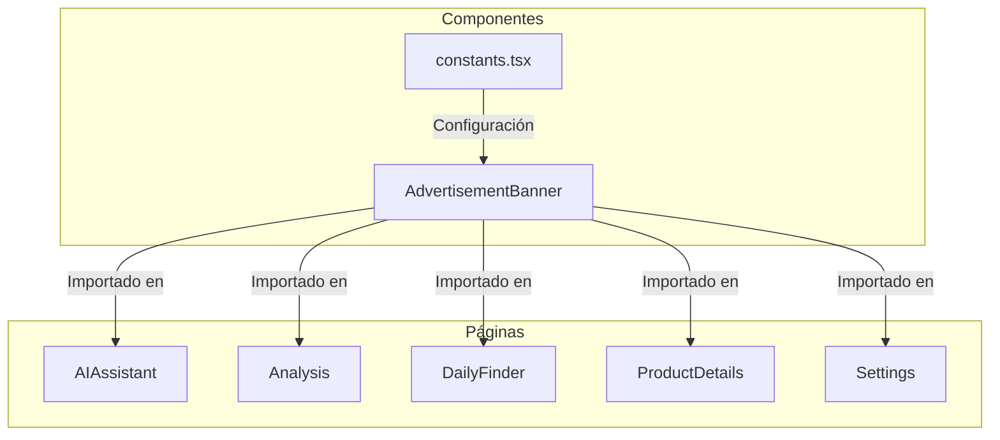

# Plan: Integración de Publicidad en Páginas de ProdIntel

## Resumen del Proyecto

Agregar espacios publicitarios a las páginas secundarias de la aplicación ProdIntel 2026 (excluyendo el Dashboard principal).

## Páginas Identificadas como "Un Solo Uso"

| Página | Archivo | Propósito |
|--------|---------|-----------|
| AI Assistant | `pages/AIAssistant.tsx` | Generador de descripciones de productos con IA |
| Analysis | `pages/Analysis.tsx` | Análisis de nicho de mercado |
| Daily Finder | `pages/DailyFinder.tsx` | Buscador de productosganadores |
| Product Details | `pages/ProductDetails.tsx` | Detalles de productos específicos |
| Settings | `pages/Settings.tsx` | Configuración del usuario |

---

## Estructura del Componente de Publicidad

### 1. Crear componente Advertisement Banner

**Archivo:** `components/AdvertisementBanner.tsx`

```typescript
interface AdvertisementBannerProps {
  position: 'top' | 'sidebar' | 'inline' | 'bottom';
  size?: 'small' | 'medium' | 'large' | 'leaderboard';
  adSlot?: string; // Para Google AdSense u otro proveedor
}
```

### 2. Tipos de Banner por Posición

| Posición | Tamaño | Dimensiones | Ubicación en Página |
|----------|--------|-------------|---------------------|
| `top` | leaderboard | 728x90 | Encabezado de página |
| `sidebar` | medium | 300x250 | Lado derecho (desktop) |
| `inline` | small | 320x100 | Entre contenido |
| `bottom` | leaderboard | 728x90 | Pie de página |

---

## Plan de Implementación por Página

### AIAssistant.tsx

- **Posición 1:** Banner inferior (después del resultado de IA)
- **Posición 2:** Banner lateral derecho (desktop)
- **Tipo:** Inline + Sidebar

### Analysis.tsx

- **Posición 1:** Banner superior (antes de estadísticas)
- **Posición 2:** Banner inferior (después del insight de IA)
- **Tipo:** Top + Bottom

### DailyFinder.tsx

- **Posición 1:** Banner superior (antes de la lista de productos)
- **Posición 2:** Banner inline (entre productos, cada 3 productos)
- **Tipo:** Top + Inline

### ProductDetails.tsx

- **Posición 1:** Banner lateral (en el panel de detalles)
- **Posición 2:** Banner inferior (después de análisis)
- **Tipo:** Sidebar + Bottom

### Settings.tsx

- **Posición 1:** Banner superior (después del título)
- **Posición 2:** Banner inferior (antes del pie de página)
- **Tipo:** Top + Bottom

---

## Archivos a Modificar

1. **`constants.tsx`** - Agregar configuración de anuncios
2. **`components/AdvertisementBanner.tsx`** - Nuevo componente
3. **`pages/AIAssistant.tsx`** - Integrar banners
4. **`pages/Analysis.tsx`** - Integrar banners
5. **`pages/DailyFinder.tsx`** - Integrar banners
6. **`pages/ProductDetails.tsx`** - Integrar banners
7. **`pages/Settings.tsx`** - Integrar banners
8. **`README.md`** - Documentar cambios

---

## Diagrama de Arquitectura



---

## Consideraciones de Diseño

1. **Responsive:** Los banners deben adaptarse a dispositivos móviles
2. **No intrusivos:** No deben interrumpir la experiencia del usuario
3. **Configurables:** Posibilidad de deshabilitar por página
4. **Proveedor flexible:** Soporte para AdSense, o placeholders para desarrollo
5. **Estilo visual:** Usar colores que coincidan con el tema oscuro de la app
